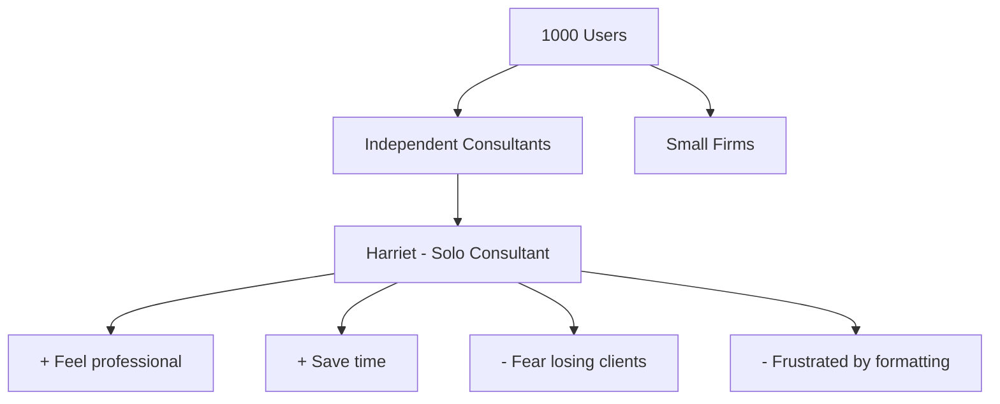

# Saga's Trigger Mapping Guide

**When to load:** During Phase 2 (Trigger Mapping) or when analyzing user psychology

---

## Core Principle

**Connect business goals to user psychology through Trigger Mapping.**

Discover not just WHO your users are, but WHY they act and WHAT triggers their decisions.

---

## What is Trigger Mapping?

**Trigger Mapping is WDS's adaptation of Impact/Effect Mapping** that focuses on user psychology.

**Key differences from generic Impact Mapping:**
- ✅ Removes solutions from the map (solutions designed *against* map, not *on* it)
- ✅ Adds negative driving forces (fears, frustrations) alongside positive ones
- ✅ Focuses on smaller, targeted maps (3-4 user groups max)
- ✅ Integrates explicit prioritization for driving forces

**Result:** Longer shelf life, deeper psychology, clearer focus.

---

## The Trigger Map Structure

**Visual Flow (Left to Right):**

```
Business Goals → Product/Solution → Target Groups → Usage Goals
(Vision +          (What you're      (Who uses it)    (Positive Drivers)
 SMART              building)                          (Negative Drivers)
 Objectives)
```

**Four-Layer Architecture:**

1. **Business Goals** (Left)
   - Vision statement(s) - inspirational direction
   - SMART objectives - measurable targets
   - Multiple goals can feed into the product

2. **Product/Solution** (Center)
   - Product name and description
   - What the product does
   - Central hub connecting goals to users

3. **Target Groups** (Middle-Right)
   - Prioritized personas (Primary 👥, Secondary 👤, etc.)
   - Connected to the product
   - Detailed psychological profiles

4. **Usage Goals** (Right)
   - **Positive Drivers** (✅ green) - What they want to achieve
   - **Negative Drivers** (❌ red) - What they want to avoid
   - Separated into distinct groups per target group
   - Both types are equally important for design decisions

---

## Business Goals Layer

### Generating Business Goals (Actionable Process)

**Structure Requirement: 3×3 Format**

Generate **3 visionary goals** with **3 objectives each** (sometimes 4-5 if truly necessary).

```
Goal 1: [Primary Outcome - e.g., Become more profitable]
  Objective 1.1: [Measurable]
  Objective 1.2: [Measurable]
  Objective 1.3: [Measurable]

Goal 2: [Prerequisite - e.g., Get happier customers]
  Objective 2.1: [Measurable]
  Objective 2.2: [Measurable]
  Objective 2.3: [Measurable]

Goal 3: [Prerequisite - e.g., Work smarter]
  Objective 3.1: [Measurable]
  Objective 3.2: [Measurable]
  Objective 3.3: [Measurable]
```

**Step 1: Identify 3 Visionary Goals (Hierarchical Order)**

Ask: "What does 'winning' look like for this business?" Extract aspirational goals from Product Brief.

Order goals hierarchically:
1. **Primary Outcome Goal** - Ultimate business success (e.g., "Become more profitable")
2. **Prerequisite Goals** - What enables the primary goal (e.g., "Get happier customers", "Work smarter")

**Common business goals:**
- Become more profitable (financial health) - often primary
- Get happier customers (satisfaction, loyalty) - often prerequisite
- Work smarter (reduce costs, less admin) - often prerequisite
- Constant customer flow (sustainable demand) - can be primary or prerequisite
- Market leadership (trusted authority) - can be primary or prerequisite

**Step 2: Attach 3 SMART Objectives Per Goal**

For each visionary goal, identify 3 specific measurements that track progress:

```
Goal 1: Become More Profitable
  Objective 1.1: Maintain 20% profit margin annually
  Objective 1.2: Grow revenue 10% year-over-year
  Objective 1.3: Achieve Page 1 ranking for key terms

Goal 2: Get Happier Customers
  Objective 2.1: Maintain 4.8+ rating
  Objective 2.2: 70%+ repeat customer rate
  Objective 2.3: Service quality consistent year-round

Goal 3: Work Smarter
  Objective 3.1: Reduce admin calls by 40%
  Objective 3.2: 70% questions answered by website
  Objective 3.3: Healthy work-life balance maintained
```

**Step 3: Verify Objective Alignment**

Each objective must align with its parent goal:

- **Profitability objectives:** Revenue, profit margin, market visibility (drives sales), pricing power
- **Customer satisfaction objectives:** Ratings, repeat rate, service quality, review sentiment
- **Operational efficiency objectives:** Time savings, cost reduction, work-life balance, automation
- **Customer flow objectives:** Discovery metrics, conversion rates, customer acquisition, seasonal consistency

❌ **Wrong alignment:** "Healthy work-life balance" under "Become More Profitable" (belongs in "Work Smarter")
✅ **Correct alignment:** "Healthy work-life balance" under "Work Smarter" (operational efficiency)

**Critical: Metrics ≠ Goals**

❌ **Don't do this:**
- "Business Goal: Reduce phone calls 40%" (metric, not aspirational)
- "Business Goal: Page 1 on Google" (tactic, not vision)

✅ **Do this:**
- "Business Goal: Work smarter → Measured by: 40% fewer calls"
- "Business Goal: Constant customer flow → Measured by: Page 1 ranking"

**Self-Check:**
- Are your goals visionary/aspirational? (exciting to achieve?)
- Do metrics support goals? (not replace them?)
- Would these goals still be relevant if tactics changed?

---

## Target Groups Layer

**Connect each target group to specific business goals they serve.**

### Example
```
Business Goal: 1,000 registered users
    ↓
Target Groups:
├── Independent consultants (high volume)
├── Small consulting firms (medium volume)
└── Freelance designers (adjacent market)
```

**Why connect:** Shows which users matter most for which goals.

---

## Detailed Personas

**Go beyond demographics → psychological depth**

### Wrong (Shallow)
> "Sarah, 35, consultant, lives in London"

**Why bad:** Doesn't help design decisions

---

### Right (Deep)
> **Harriet the Hairdresser**
> 
> Owns a salon, 15 years experience, ambitious. Wants to be seen as the "queen of beauty" in her town - not just another hairdresser, but THE expert everyone comes to. Fears falling behind competitors who have better online presence. Frustrated by not knowing how to market herself effectively. In her salon context, she's confident. In the digital marketing context, she feels like a beginner.

**Why better:** You can design for her psychology

---

### Persona Section Structure

Each detailed persona should include these sections:

**Required Sections:**

1. **Who [Name] Is** - Context, background, life situation (2-3 sentences)
2. **Psychological Profile** - How they think, what they value, their relationship to the problem (2-3 paragraphs with **bold key traits**)
3. **Internal State** - Emotional relationship when thinking about the problem/solution (1 paragraph with **bold emotion words**)
4. **Usage Context** - When/how/why they interact with product (see template below)
5. **Relationship to Business Goals** - Explicit connection to each relevant goal with rationale
   - Format: `✅ **[Goal Name]:** [How this persona serves this goal]`

**Example Structure:**

```markdown
### Lars Lojal (Lars the Loyal) — Priority 1

**Who Lars Is:**
Lars lives 45 minutes from Löttorp but has brought every vehicle to Källa for 12 years. Two cars, camper van, trailers — if it has wheels, Björn has seen it. Late 50s, works in Kalmar, summer house near Byxelkrok.

**Psychological Profile:**
Lars values **loyalty and consistency** above almost everything. Once he finds someone trustworthy, he sticks with them. He's seen other mechanics — chain workshops, "quick fix" places — and finds them impersonal and unpredictable. With Björn, Lars knows what to expect: honest diagnosis, fair price, work done when promised.

**Internal State:**
When Lars thinks about car service, he feels **calm and secure**. There's no anxiety, no "will they rip me off?" worry. Björn is like family. Lars takes pride in this relationship.

**Usage Context:**
Lars checks the website occasionally, mostly to confirm hours before calling. He already has Björn's number saved. He might visit the site to show someone else: "See, this is the place I go to." The website reinforces his choice — certifications, reviews, professionalism.

**Relationship to Business Goals:**
- ✅ **Become More Profitable:** Highest lifetime value — multiple vehicles, predictable revenue
- ✅ **Get Happier Customers:** Loyal for 12 years, refers others, never complains
- ✅ **Work Smarter:** Books ahead, minimal hand-holding, trusts recommendations
```

---

### Usage Context Template

For each persona's Usage Context section, answer:

**1. Access/Discovery:** How do they find/reach the product?
- Example: "Google search 'motorhome repair Öland'"
- Example: "Has phone number saved, checks website for hours"

**2. Emotional State:** What do they feel during usage?
- Example: "Panic mode, stressed, vulnerable"
- Example: "Calm and secure, already trusts the service"

**3. Behavior Pattern:** How do they interact?
- Example: "Scans quickly, doesn't read paragraphs, looks for trust signals"
- Example: "Reads carefully, wants to understand details"

**4. Decision Criteria:** What signals matter most?
- Example: "Capability confirmation (do you fix X?), trust signals (reviews, certifications)"
- Example: "Price transparency, availability, booking process"

**5. Success Outcome:** What gets them to take action?
- Example: "Finds phone number and calls within 30 seconds"
- Example: "Feels confident enough to book appointment"

**Full Example (Hasse the Motorhome):**

```markdown
**Usage Context:**
Hasse finds the website via Google search. He's scanning for **trust signals and capability confirmation**:
- ✅ "Husbilservice" listed → Okay, they do motorhomes
- ✅ "20+ years, Autoexperten certified" → Seems legitimate
- ✅ "4.8/5 reviews" → Other people trust them
- ✅ Phone number huge and visible → I can call NOW

He doesn't read paragraphs. He scans, checks, decides, calls. The website's job is to get him to that call within 30 seconds.
```

---

## Usage Goals vs User Goals

**Critical distinction:**

### User Goals (Life Context)
What they want in general life:
- Be a successful consultant
- Provide for family
- Be respected in industry

---

### Usage Goals (Product Context)
What they want when using your product:
- Feel prepared for client meeting
- Look professional to prospects
- Save time on formatting

**Design for usage goals, informed by user goals.**

---

## Context-Dependent Goals

**The Dubai Golf Course Example:**

A golfer using a booking form has specific **usage goals** in that moment:
- Book a tee time quickly
- See availability clearly
- Feel confident about the booking

What they do at the resort restaurant later is a **different context** with different usage goals. Don't conflate them!

**The Harriet Example:**

When booking beauty product supplier:
- **Active goal:** "Compare prices efficiently"
- **Not active:** "Feel like queen of beauty" (that's in salon context)

When marketing her salon online:
- **Active goal:** "Feel like queen of beauty"
- **Not active:** "Compare supplier prices" (different context)

**Design for the active goals in THIS usage context.**

---

## Driving Forces (The Psychology)

### Positive Driving Forces (Wishes/Desires)
**What pulls them forward?**

- Want to feel prepared
- Want to look professional
- Want to impress clients
- Want to save time
- Want to be seen as expert

**Trigger these** through your design and content.

---

### Negative Driving Forces (Fears/Frustrations)
**What pushes them away from current state?**

- Fear looking unprofessional
- Fear losing clients to competitors
- Frustrated by wasted time on formatting
- Anxious about making mistakes
- Worried about missing deadlines

**Address these** through reassurance and solutions.

---

### The Power of Both

**Same goal, different messaging:**

- Positive framing: "Feel confident and prepared"
- Negative framing: "Stop worrying about embarrassing mistakes"

Both are valid! Often negative triggers action faster (pain > pleasure).

---

### Driving Forces Pattern: WHAT + WHY + WHEN

Good driving forces follow this pattern:
**[WHAT they want/fear] + [WHY it matters] + [WHEN/CONTEXT]**

This pattern creates actionable, specific forces that directly inform design decisions.

**✅ Good Examples (Specific, contextual, actionable):**

- "Find immediate reassurance of capability within 30 seconds"
  - WHAT: reassurance about capability
  - WHY: stressed/urgent need
  - WHEN: searching on phone in panic mode

- "Confirm specialized capability before calling"
  - WHAT: capability verification
  - WHY: avoid wasted call, seasonal planning
  - WHEN: preparing for busy season, needs to book ahead

- "Validate loyalty choice when showing website to others"
  - WHAT: validation of decision
  - WHY: justify 45-minute drive, maintain identity as smart chooser
  - WHEN: referring friends or colleagues

**❌ Too Vague (Not actionable):**

- "Want convenience" → Too generic, applies to everything
- "Want peace of mind" → What creates peace of mind specifically?
- "Want good experience" → What does "good" mean in this context?
- "Feel confident" → About what? When? Why?

**Test Your Driving Force:**

1. **Actionability:** Can a designer create a specific feature to address this?
2. **Psychology:** Does it reveal motivation beyond "wants it to work well"?
3. **Context:** Is it clear WHEN this force is active during product usage?

If no to any question, add more specificity using WHAT + WHY + WHEN.

**Before/After Example:**

❌ Before: "Want to feel secure"
✅ After: "Feel secure about future availability — wants reassurance that mechanic won't suddenly close or retire (when considering long-term loyalty)"

❌ Before: "Need help quickly"
✅ After: "Get back on road quickly — vacation timeline is tight, every hour stuck is lost experience (when breakdown happens mid-trip)"

---

## Prioritizing Driving Forces

**Once all driving forces are identified, prioritize using Feature Impact Analysis:**

### Scoring Method (Frequency × Intensity × Fit)

Score each driving force on three dimensions (1-5 scale):

**1. Frequency (1-5):** How often does this force matter?
- **5** = Every interaction / constant concern
- **4** = Most of the time
- **3** = Regularly but not always
- **2** = Occasional
- **1** = Rare edge case

**2. Intensity (1-5):** How strongly do they feel this?
- **5** = Critical, visceral, blocks action if not addressed
- **4** = Very important, strong emotion
- **3** = Important but manageable
- **2** = Mild concern
- **1** = Nice to have, minimal emotion

**3. Fit (1-5):** How well can the product address this?
- **5** = Perfect fit, direct solution
- **4** = Strong fit, clear approach
- **3** = Moderate fit, partial solution
- **2** = Weak fit, indirect approach
- **1** = Hard to address with this product

**Total Score = Frequency + Intensity + Fit (max 15)**

### Score Interpretation

**14-15: HIGH PRIORITY**
- Must address in core product
- Core to user success
- Strong ROI on design effort

**11-13: MEDIUM PRIORITY**
- Should address if feasible
- Significant but not critical
- Enhances experience

**8-10: LOW PRIORITY**
- Nice to have
- Limited strategic impact
- Consider for future iterations

**<8: DEPRIORITIZE**
- Minimal strategic value
- Resource drain vs. benefit
- May indicate wrong target group

### Example Scoring

```
Hasse Husbil: "Find immediate reassurance of capability"
├── Frequency: 5 (every stressed tourist in panic mode)
├── Intensity: 5 (critical to their decision to call)
├── Fit: 5 (website can show this immediately)
└── Total: 15/15 → HIGH PRIORITY

Lars Lojal: "Feel secure about future availability"
├── Frequency: 3 (occasional worry, not constant)
├── Intensity: 5 (very important to him emotionally)
├── Fit: 3 (hard to guarantee, can signal continuity)
└── Total: 11/15 → MEDIUM PRIORITY

Siv Skötsam: "See detailed pricing upfront"
├── Frequency: 4 (checks before every service)
├── Intensity: 3 (wants it but will call anyway)
├── Fit: 2 (car repair pricing is context-dependent)
└── Total: 9/15 → LOW PRIORITY
```

### Using Scores Strategically

**Prioritize Features:**
- Design for 14-15 forces first
- Group 11-13 forces into common solutions
- Defer <10 forces until core experience is solid

**Defend Decisions:**
- "This feature addresses 3 forces with 14+ scores"
- "We're deprioritizing X because it scored 7/15"

**Identify Gaps:**
- High-intensity forces with low fit = product limitation
- High-frequency, low-intensity = table stakes (must have, but not differentiator)
- Low-frequency, high-intensity = edge case (support via other channels)

---

## Customer Awareness Integration

**Every scenario should move users through awareness stages:**

```
Trigger Map shows:
└── User + Driving Forces

Scenario adds:
├── Starting Awareness: Problem Aware (knows proposals are weak)
└── Target Awareness: Product Aware (knows our solution helps)
```

**Example:**
- **Start:** "I know my proposals lose clients" (Problem Aware)
- **Through scenario:** Experience our solution working
- **End:** "This tool makes my proposals professional" (Product Aware)

---

## Common Trigger Mapping Mistakes

### ❌ Too Many Target Groups
"Let's map 10 different user types..."

**Why bad:** Dilutes focus, overwhelming, unused

**Instead:** 3-4 groups max, deeply understood

---

### ❌ Shallow Personas
"John, 32, works in consulting..."

**Why bad:** Doesn't inform design

**Instead:** Deep psychology, usage context, active goals

---

### ❌ Only Positive Forces
"Users want to save time and be efficient..."

**Why bad:** Missing powerful negative triggers

**Instead:** Positive AND negative (fears drive action!)

---

### ❌ Solutions on the Map
"They need a template library and e-signature..."

**Why bad:** Locks in solutions too early, map ages quickly

**Instead:** Map psychology, design solutions against it

---

### ❌ Generic Goals
"Want a better experience..."

**Why bad:** Too vague to design for

**Instead:** Specific, contextual: "Want to feel prepared before client meeting"

---

## Trigger Map → Design Context

**For a specific design task, extract the relevant slice:**

```
Trigger Map (Comprehensive):
├── 3 business goals
├── 4 target groups
├── 12 detailed personas
└── 40+ driving forces

Design Context (Focused):
├── 1 business goal
├── 1 persona
├── 1 solution context
└── 3-5 key driving forces
```

**The focused context is the "working copy" for a specific design task.**

---

## Visual Mermaid Diagrams

**Create visual trigger maps using Mermaid syntax:**



**See:** `../../workflows/2-trigger-mapping/mermaid-diagram/`

---

## Workshop Process

**Trigger Mapping is collaborative:**

1. **Define business goals** (Vision + SMART)
2. **Identify target groups** (connect to goals)
3. **Create personas** (psychological depth)
4. **Discover driving forces** (positive + negative)
5. **Prioritize forces** (Feature Impact Analysis)
6. **Generate visual map** (Mermaid diagram)
7. **Document findings** (structured markdown)

**See:** `../../workflows/2-trigger-mapping/workshops/`

---

## When to Update Trigger Map

**Trigger Maps evolve:**

- ✅ New user research reveals different psychology
- ✅ Business goals change
- ✅ New target groups emerge
- ✅ Priorities shift based on data

**Process:**
1. Create new version (v2)
2. Document what changed and why
3. Review impact on active design work
4. Keep old version for reference

---

## Related Resources

- **Phase 2 Workflow:** `../../workflows/2-trigger-mapping/`
- **Impact/Effect Mapping Model:** `../../docs/models/impact-effect-mapping.md`
- **Trigger Mapping Guide:** `../../docs/method/phase-2-trigger-mapping-guide.md`
- **Customer Awareness Cycle:** `../../docs/models/customer-awareness-cycle.md`
- **Feature Impact Analysis:** Prioritization method based on Impact Mapping

---

*Trigger Mapping connects business goals to user psychology. It's the strategic foundation that makes design purposeful.*


