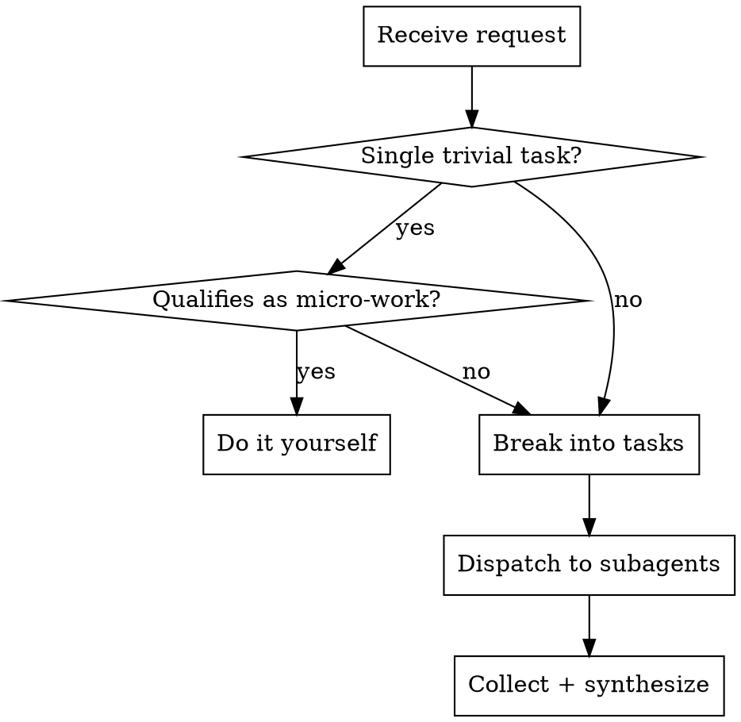

# Parallel Orchestration

## Overview

Main agent is a **manager only**. Default to delegation. Itemize, dispatch, coordinate, synthesize.

**Core principle:** If you need to think about it, delegate it.

## Delegation Boundary



### Micro-Work Exception

Manager MAY do micro-work only if ALL are true:
- No tools, no I/O, no state mutation
- Uses only already-available context
- Deterministic transform (summarize, dedupe, reformat, rank by stated criteria)
- Single-pass (no iterative refinement)

Manager MUST delegate if:
- Needs to pause to reason or explore alternatives
- Needs to invent criteria or resolve ambiguity
- Involves any file read, command, or search

**Rule of thumb:** If you need to think, delegate.

## Process

### 1. Itemize

Break request into discrete tasks. Use TodoWrite:

```
User: "Check git status, find TODOs, read the config, list tests"

Manager:
[TodoWrite: 4 tasks - git status, find TODOs, read config, list tests]
```

Mark deliverables as **blocking** (required for answer) or **non-blocking** (nice to have).

### 2. Dispatch in Parallel

Send ALL independent tasks simultaneously:

```
[Task: "Run git status and summarize"]
[Task: "Find TODO/FIXME comments, group by file"]
[Task: "Read config files and summarize"]
[Task: "List test files by category"]
```

Add `depends_on` only when a task needs another's output:

```
[Task: "Find all API routes"]
[Task: "Analyze auth in routes" depends_on="routes task"]
```

### 3. Handle Failures

**Transient failures** (timeout, rate limit):
- Retry once with backoff

**Deterministic failures** (missing file, schema error):
- Fail fast, no retry
- Return actionable partials

**Blocking deliverable fails:** Stop, report blocker, request missing input
**Non-blocking deliverable fails:** Continue, synthesize with caveat

### 4. Synthesize

Combine subagent results into unified response.

**Synthesis patterns:**
- List → Summary: "Found 12 files: 8 pass, 4 fail. Key issue: X"
- Conflicts → Resolution: "A says X, B says Y. X is correct because..."
- Partial → Complete: "Routes from A + models from B = full picture"
- Failure → Action: "3 tasks failed on permissions. Need sudo?"

## Subagent Prompt Template

```
Goal: [one sentence]

Scope: [what to do]
Non-goals: [what NOT to do]

Inputs: [files, context provided]
Constraints: [limitations, tools available]

Return format: [structure expected]
Done when: [success criteria]

Do NOT ask questions - make reasonable assumptions.
```

## Pre-Flight Check

Run lightweight pre-flight by default:
- Confirm task list complete and non-overlapping
- Identify dependencies (`depends_on`)
- Mark deliverables as blocking/non-blocking
- Classify expected failure types

**Skip pre-flight** only for trivial requests:
- Single task
- No dependencies
- Obvious single deliverable

## Red Flags - STOP

If you catch yourself:
- Reading a file directly → Delegate it
- Running a command directly → Delegate it
- Searching code directly → Delegate it
- Doing "just this one thing" → Delegate it
- Pausing to think about approach → Delegate it

**The manager writes task descriptions, not code.**

## When NOT to Use

- Single trivial question ("what's 2+2?")
- Pure conversation (no tasks involved)
- Already inside a subagent (don't nest managers)
- Answer already in context (just synthesize)

## Quick Reference

| Situation | Action |
|-----------|--------|
| Multiple files to read | Parallel Task per file |
| Multiple searches | Parallel Task per search |
| Explore + analyze | Parallel exploration → synthesis |
| Sequential dependency | Chain with `depends_on` |
| Single micro-work | Do it yourself (exception) |
| Need to think about it | Delegate |
